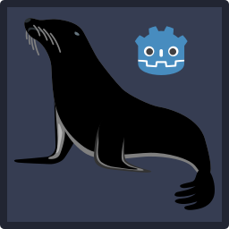

<h1 align="center" style="font-size: 2.5em;">Godot MariaDB Connector Plugin</h1>

<p align="center">
  
</p>

A **GDExtension-based** MariaDB connector for **Godot 4**, allowing direct database access from Godot without relying on third-party middleware.

## Features
- Connect to **MariaDB** databases directly from Godot.
- Perform queries, insert/update/delete operations, and handle results.
- MySQL Native(SHA1) and ED25519(SHA512) authentication, **plain or pre-hashed passwords**.
- Argon2 slow hash Argon2Hasher class wrapper, with high entropy salt generation function.
- Cross-platform support (Linux, Windows, ARM64).
- Uses **GDExtension**, requiring no custom engine builds.

## Installation
### Download the Addon from the Godot editor AssetLib tab.
or
### 1. Download the Addon
Clone or download the repository:
```sh
git clone https://github.com/sigrudds1/Godot-MariaDB-Connector-Plugin.git
```
Or download the latest release from **[Releases](https://github.com/sigrudds1/Godot-MariaDB-Connector-Plugin/releases)**.

### 2. Add to Your Godot Project
Move the **`addons/mariadb_connector/`** folder into your project's directory.

### 3. GDExtension Auto-Detection
Since this is a **GDExtension**, it does **not** require enabling in the Godot plugin settings. Once the files are in place, Godot will automatically detect and load the extension.

*(Note: the AssetLib does not update the addon automatically, requires closing the project, deleting the `<project>/addons/mariadb_connector/` folder and reinstallation.)*

## Usage
For detailed usage examples, please refer to the **Demo Project** included in the repository.

You can find the demo inside the `demo/` folder, which demonstrates how to:

- Connect to a MariaDB database.
- Execute queries (SELECT, INSERT, UPDATE, DELETE).
- Handle results properly.
- Configure and create hashed using Argon2Wrapper and generated salt, using the added function.

## License

Unlike many other database connectors, this plugin is licensed under **MIT**, not **GPL**. Although **MariaDB itself is GPL**, this connector **only communicates with MariaDB servers via standard network protocols**—meaning it does **not** fall under GPL’s derivative work restrictions. This ensures **no licensing conflicts** when using this plugin in **closed-source** or **commercial** Godot projects.

## Contributing

1. Fork the repository.
2. Create a feature branch.
3. Commit your changes.
4. Submit a Pull Request.

You can find the build instructions at [Godot Docs](https://docs.godotengine.org/en/stable/tutorials/scripting/gdextension/gdextension_cpp_example.html).

## Support

For issues, open a ticket on [GitHub Issues](https://github.com/sigrudds1/Godot-MariaDB-Connector-Plugin/issues).

## Donations
If you find this project useful and would like to support development, consider donating:
- [Patreon](https://www.patreon.com/c/sigrudthetinkerer/membership)
- [Buy Me a Coffee](https://buymeacoffee.com/VikingTinkerer)
- [Ko-fi](https://ko-fi.com/vikingtinkerer)

## Version Updates
v1.2.1 - Added authtyoe description to editor docs.
v1.2   - Added PHC Winner Argon2 slow hash and mbedtls based high entropy salt generation that uses the salt length property.

## Bug Fixes
v1.2   - Zapped reintroduced prehash = false bug, for good this time.
